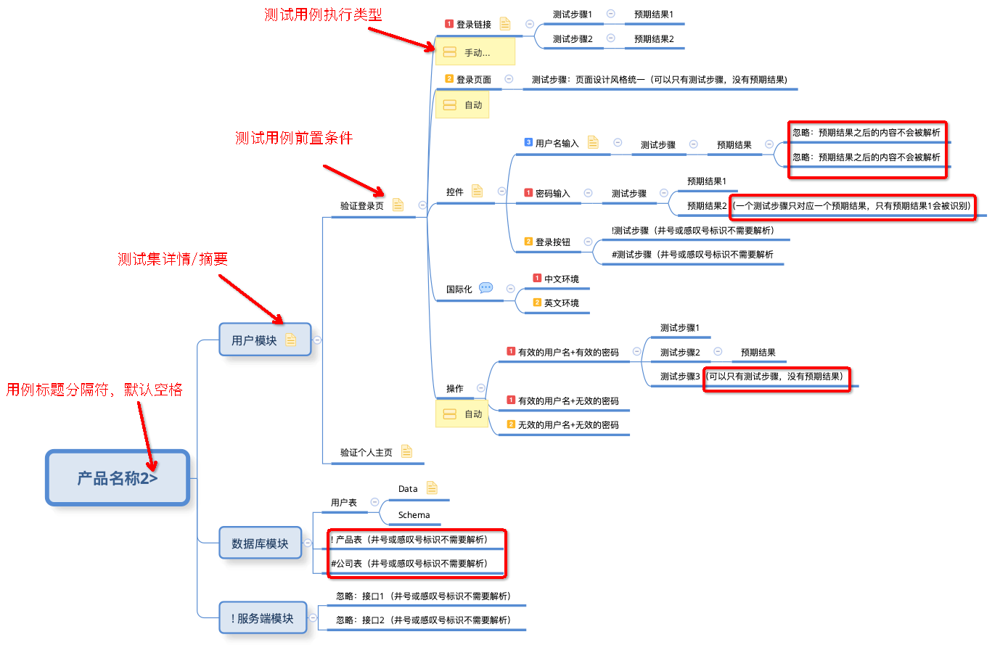
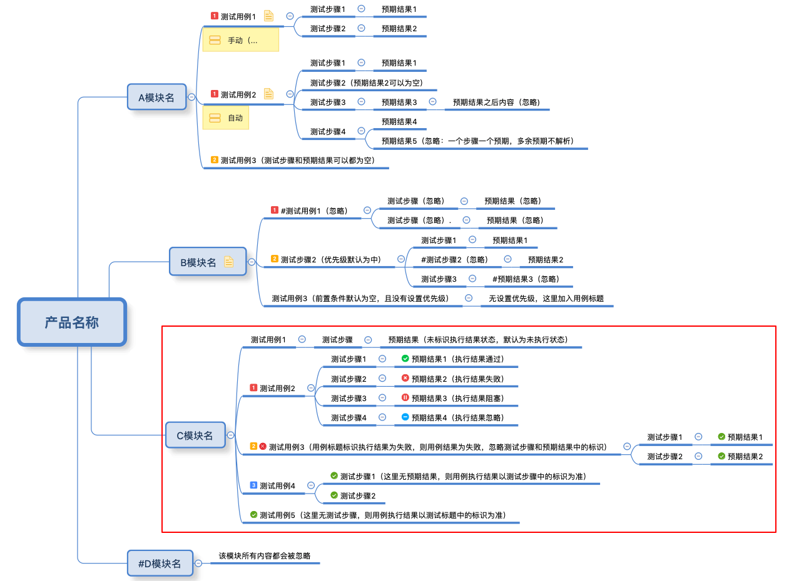
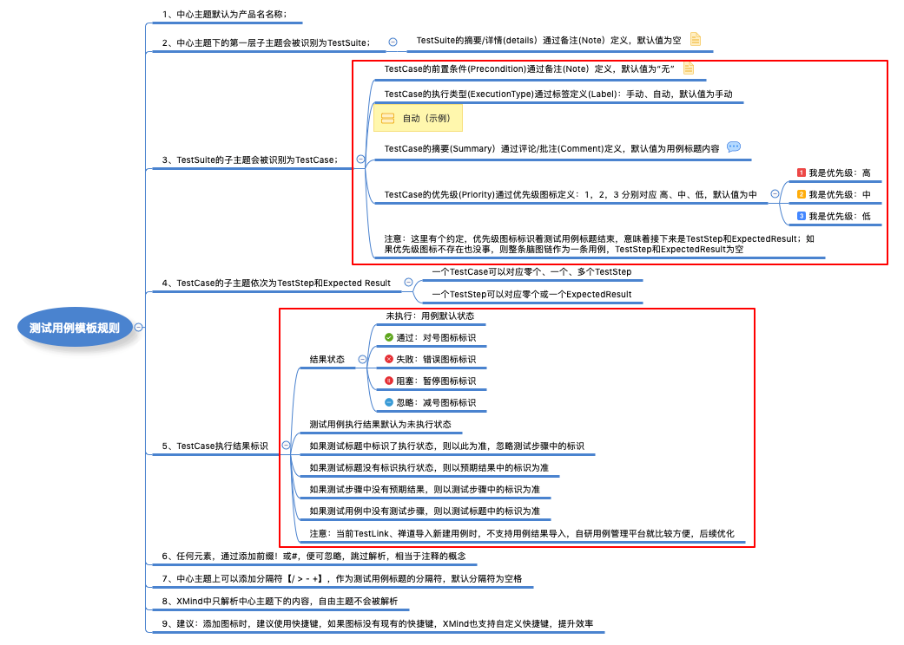
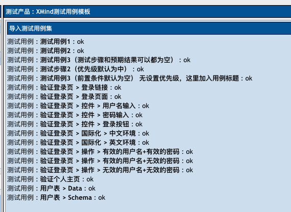
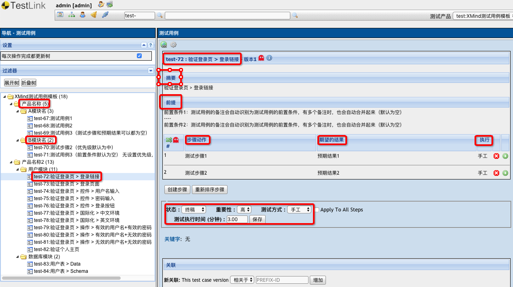
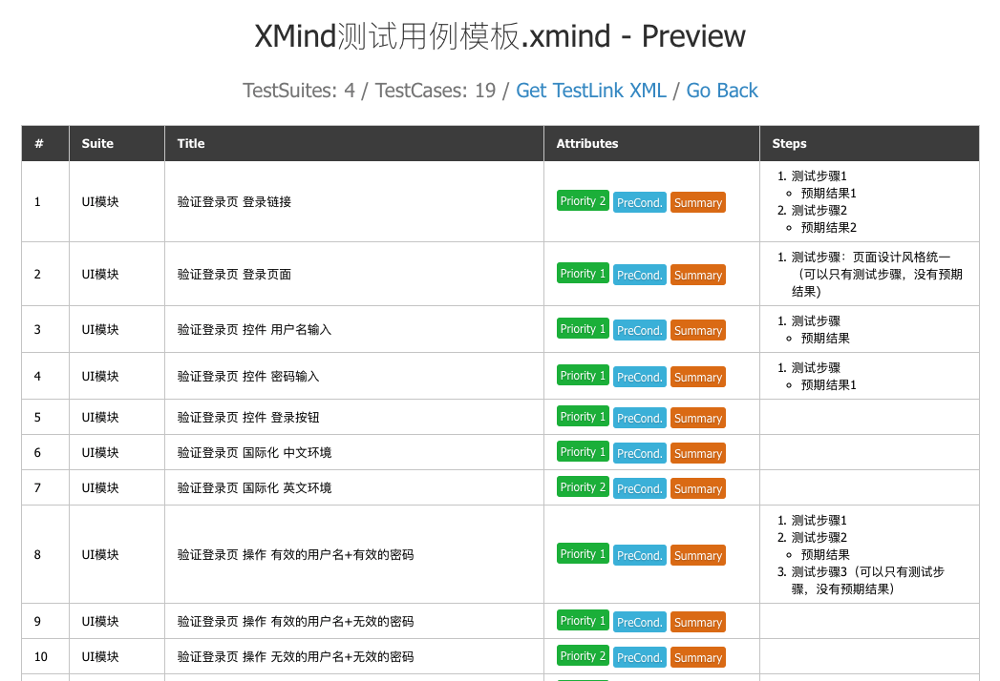

# XMind2TestCase 使用指南


### 一、XMind测试用例通用模板

#### 1、简单模板示例


#### 2、简单模板示例解析结果


#### 3、具体解析规则


**注意，注意，注意，重要的事情说三遍！！！**

第六条规则，我们使用标注**优先级图标**作为"测试标题"与"测试步骤"界线，如果解析过程没有遇到**优先级图标**，则TestSuite后面的子主题链作为一条测试用例。
一条测试用例支持只有标题，没有测试步骤和预期结果，因为实际测试过程中，我们常常通过用例标题就可以明确测试点了。

之所以有第六条规则这样设计，因为实际测试用例设计过程中，我们所测产品往往有非常多的模块和层级。

#### 4、多级模板示例



#### 5、多级模板解析结果


#### 6、支持标识用例执行结果模板示例(新功能）



#### 7、支持标识用例执行结果模板规则（增加标识用例结果规则）




### 二、导入TestLink

#### 1、将XMind用例文件解析为TestLink导入文件

```
xmind2testlink XMind测试用例模板.xmind -xml  ==> XMind测试用例模板.xml
```

#### 2、在TestLink上创建对应测试项目，然后导入转换后的文件


#### 3、TestLink导入状态示例



#### 4、TestLink导入结果示例




### 三、导入禅道（ZenTao)

#### 1、将XMind用例文件解析为禅道导入文件

```
xmind2testcase XMind测试用例模板.xmind -csv  ==> XMind测试用例模板.csv
```

#### 2、禅道导入过程跟TestLink类似，结果示例


注意：不过由于禅道系统在导入测试用例文件时，不会自动生成模块名，需要创建项目时，顺便把模块名创建好。而且导入用例时，需要填写对应的模块名和ID。

如果导入时，模块名没有事先创建好，那默认所有导入的测试用例归为**根模块**'/'所有，不会不能导入。

不过，还是建议创建好模块名，以便后续用例管理，流程如下：


- 在"维护模块"中创建好模块名，然后通过导出模板文件（GBK)，就可以查看模块名对应的ID；
- 如果导入时，没有事先创建好模块名，就不会显示上图中方框中的模块名信息；
- 导入的用例文件使用的是UTF-8编码；

填写了模块ID的XMind用例文件，示例如下：


### 四、使用Web转换工具

#### 1、通过命令在本地启用Web工具

```
# 默认使用5001端口好
xmind2testcase webtool        => launch the web testcase convertion tool locally -> 127.0.0.1:5001

# 支持自定义端口号
xmind2testcase webtool 8000   => launch the web testcase convertion tool locally -> 127.0.0.1:8000
```

#### 2、在浏览器访问Web工具


- 支持选择XMind用例文件进行TestLink、ZenTao格式转换；
- 支持下载原XMind文件、TestLink文件、ZenTao文件下载；
- 支持下载原XMind文件、TestLink文件、ZenTao文件删除；
- 支持转换后的测试用例预览；

#### 3、测试用例预览示例



### 五、相关内容
- [XMind测试用例模板.xmind下载](XMind测试用例模板.xmind)
- [XMind2TestCase:一个高效测试用例设计的解决方案！](https://github.com/zhuifengshen/xmind2testcase)
- [XMind:XMind思维导图创建、解析、更新的一站式解决方案！](https://github.com/zhuifengshen/xmind)